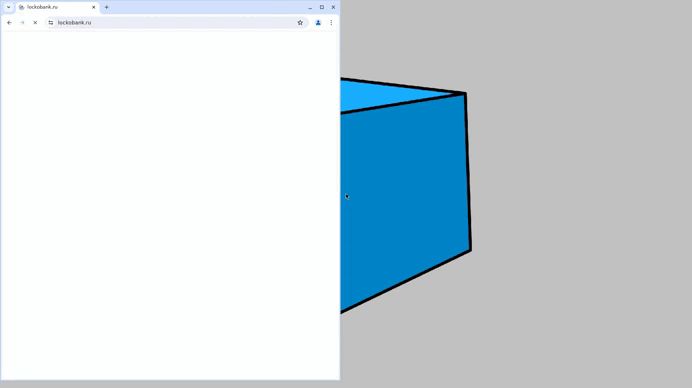

# Проект по автоматизации тестирования для компании [ЛОКО банк](https://www.lockobank.ru/about/)

> Локо банк — Универсальный коммерческий банк с 30-летним опытом.

## **Содержание:**
____

* <a href="#tools">Технологии и инструменты</a>

* <a href="#cases">Примеры автоматизированных тест-кейсов</a>

* <a href="#jenkins">Сборка в Jenkins</a>

* <a href="#console">Запуск из терминала</a>

* <a href="#allure">Allure отчет</a>

* <a href="#allure-testops">Интеграция с Allure TestOps</a>

* <a href="#telegram">Уведомление в Telegram при помощи бота</a>

* <a href="#video">Примеры видео выполнения тестов на Selenoid</a>
____
<a id="tools"></a>
## <a name="Технологии и инструменты">**Технологии и инструменты:**</a>

<p align="center">  
<a href="https://www.jetbrains.com/idea/"></a>  
<a href="https://www.java.com/"></a>  
<a href="https://github.com/"></a>  
<a href="https://junit.org/junit5/"></a>  
<a href="https://gradle.org/"></a>  
<a href="https://selenide.org/"></a>  
<a href="https://aerokube.com/selenoid/"></a>  
<a href="ht[images](images)tps://github.com/allure-framework/allure2"></a> 
<a href="https://qameta.io/"></a>   
<a href="https://www.jenkins.io/"></a>   
</p>

____
<a id="cases"></a>
## <a name="Примеры автоматизированных тест-кейсов">**Примеры автоматизированных тест-кейсов:**</a>
____
-  *Проверка полей таблицы с Тарифами по страхованию*
-  *Проверка меню на английском языке*
-  *Проверка меня на русском языке*
-  *Проверка названия раздела на странице Private-banking*
-  *Проверка файла инструкции инструкции*

____
<a id="jenkins"></a>
## </a><a name="Сборка"></a>Сборка в [Jenkins](https://jenkins.autotests.cloud/job/032-TKI308-jenkins-FastProject/)</a>
____
<p align="center">  
<a href="https://jenkins.autotests.cloud/job/032-TKI308-jenkins-FastProject/)/"></a>  
</p>


### **Параметры сборки в Jenkins:**

- *browser (браузер, по умолчанию chrome)*
- *browserVersion (версия браузера, по умолчанию 100.0)*
- *browserSize (размер окна браузера, по умолчанию 1920x1080)*
- *remoteUrl (логин, пароль и адрес удаленного сервера Selenoid)*

<a id="console"></a>
## Команды для запуска из терминала
___
***Локальный запуск:***
```bash  
gradle clean Loko_test
```

***Удалённый запуск через Jenkins:***
```bash  
clean
Loko_test
"-DremoteHost=${REMOTEHOST}"
"-Dbrowser=${BROWSER}"
"-DbrowserVersion=${VERSION_BROWSER}"
"-DbrowserSize=${BROWSER_SIZE}"
```
___
<a id="allure"></a>
## </a> <a name="Allure"></a>Allure [отчет](https://jenkins.autotests.cloud/job/032-TKI308-jenkins-FastProject/11/allure/)</a>
___

### *Основная страница отчёта*

<p align="center">  
  
</p>  

### *Тест-кейсы*

<p align="center">  
  
</p>

### *Графики*

<p align="center">  

 
</p>

___
<a id="allure-testops"></a>
## </a>Интеграция с <a target="_blank" href="https://allure.autotests.cloud/launch/44397">Allure TestOps</a>
____
### *Allure TestOps просмотр запусков Jenkins*

<p align="center">  
  
</p>  

<p align="center">  
  
</p> 


____


<a id="telegram"></a>
## </a> Уведомление в Telegram при помощи бота
____
<p align="center">  
  
</p>

____
<a id="video"></a>
## </a> Примеры видео выполнения тестов на Selenoid
____
<p align="center">
   
</p>
